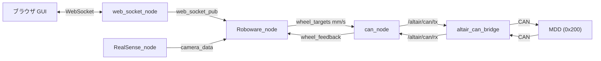

# Person_Tracking_Roboware README

## 概要

ROS2 をベースにした人追従ロボット用パッケージ。
RealSense カメラで人物の距離と方向を計測し、修正比例航法 (MPN) で追従制御を行う。
低レイヤーの通信は CAN バスを使用し、altair_framework の altair_can_bridge を通じて
MDD (モータドライバ, ID: 0x200) と通信する。

---

## システム構成



### ノード一覧

- Roboware_node: 制御の中心ノード。モード切り替えと追従演算 (MPN) を担当
- RealSense_node: RealSense カメラから人物の距離・オフセットを取得
- can_node: CAN 通信を担当。altair_can_bridge 経由で MDD に速度指令を送受信
- web_socket_node: ブラウザ GUI との WebSocket 通信を仲介
- FaceAnimation_node: 顔アニメーション表示

旧ノード (互換性維持のため残存、通常は起動しない):
- serial_send_node / serial_read_node: CAN 移行前のシリアル通信ノード
- PID_node: PC 側 PID (マイコン内 PID に移行済み)

---

## 依存パッケージ

altair_framework が事前にビルド・ソース済みであること。
- altair_can_bridge: CAN 物理層との橋渡し (USB-CAN / Ethernet-CAN 対応)
- altair_interfaces: CAN 関連メッセージ型
- can_msgs: ROS2 標準 CAN フレームメッセージ

```bash
# altair_framework 側でビルド (初回のみ)
cd ~/altair_framework
colcon build
source install/setup.bash
```

---

## セットアップ

```bash
cd ~/Roboware   # Person_Tracking_Roboware のルート
colcon build --packages-select Robowarepkg
source install/setup.bash
```

---

## 起動方法

### 一括起動 (推奨)

WezTerm が必要。各ノードが別タブで起動される。

```bash
cd ~/Roboware
bash start_all_nodes.sh
```

起動されるノード:
- RealSense_node
- web_socket_node
- Roboware_node
- can_node
- FaceAnimation_node

### 手動起動 (個別)

```bash
# 別ターミナルでそれぞれ実行
ros2 run Robowarepkg RealSense_node
ros2 run Robowarepkg web_socket_node
ros2 run Robowarepkg Roboware_node
ros2 run Robowarepkg can_node
```

---

## CAN 通信仕様

CAN デバイス (USB-CAN) は altair_can_bridge が自動検出・接続する。
接続後、can_node が自動でパラメータを送信して制御モードに移行する。

### CAN ID 一覧 (MDD 0x200 ベース)

| CAN ID | 方向 | 内容 |
|--------|------|------|
| 0x200 | PC -> MDD | ch1 (右モータ) PID パラメータ |
| 0x201 | PC -> MDD | ch2 (左モータ) PID パラメータ |
| 0x210 | PC -> MDD | モード設定 (0=速度制御) |
| 0x220 | PC -> MDD | 速度目標値 [ch1, ch2] 10ms 周期 |
| 0x230 | MDD -> PC | システムステータス |
| 0x250 | MDD -> PC | 速度フィードバック (rps 単位) |

### パラメータフレームのペイロード (0x200 / 0x201)

```
[ int16: P*1000 | int16: I*1000 | int16: D*1000 | int16: タイヤ径mm*方向 ]
```

### 速度目標値フレームのペイロード (0x220)

```
[ int16: ch1_rps*10 | int16: ch2_rps*10 | int16: 0 | int16: 0 ]
```

wheel_targets (mm/s) からの変換式:

```
rps = mm_s / (π × diameter_mm)
int16 = clamp(int(rps × 10), -32768, 32767)
```

---

## PID パラメータ設定

パラメータは `src/Robowarepkg/mdd_params.json` に保存される。

```json
{
  "ch1": { "p": 1.0, "i": 0.0, "d": 0.0, "direction": 1, "diameter_mm": 100.0 },
  "ch2": { "p": 1.0, "i": 0.0, "d": 0.0, "direction": 1, "diameter_mm": 100.0 }
}
```

- direction: モータの回転方向。正転なら 1、逆転なら -1
- diameter_mm: タイヤの外径 (mm)

### GUI からの変更手順

ブラウザで `http://<ロボットのIP>:8080` を開く。
"MDDパラメータ設定" パネルで各値を入力して "保存 + 再送信" を押す。
JSON ファイルへの書き込みと CAN へのパラメータ再送信が自動で行われる。

### CAN での手動再送信

```bash
ros2 service call /roboware/can/send_params std_srvs/srv/Trigger {}
```

---

## WebSocket / GUI 仕様

- URL: `http://<ロボットのIP>:8080`
- HTML ファイル: `/home/altair/Roboware/UI.txt`

### 受信コマンド形式 (ブラウザ -> サーバ)

通常のゲームパッド / モード操作は CSV 文字列:

```
mode,rx,ry,lx,ly,stop
```

| フィールド | 内容 |
|-----------|------|
| mode | 0=手動, 1=追跡 |
| rx/ry | 右スティック (0-200, 中立=100 付近) |
| lx/ly | 左スティック (0-200, 中立=100 付近) |
| stop | 1=緊急停止 |

MDD パラメータ更新は JSON 形式:

```json
{ "type": "mdd_params", "params": { "ch1": {...}, "ch2": {...} } }
```

---

## トピック一覧

| トピック | 型 | 方向 | 内容 |
|---------|-----|------|------|
| web_socket_pub | String | web_socket -> Roboware | GUI コマンド |
| camera_data | Float32MultiArray | RealSense -> Roboware | [距離m, オフセットm] |
| wheel_targets | Float32MultiArray | Roboware -> can_node | [右mm/s, 左mm/s] |
| wheel_feedback | Float32MultiArray | can_node -> Roboware | [右rps, 左rps] |
| /altair/can/tx | can_msgs/Frame | can_node -> bridge | CAN 送信フレーム |
| /altair/can/rx | can_msgs/Frame | bridge -> can_node | CAN 受信フレーム |
| /altair/can/status | CanStatus | bridge -> all | CAN 接続状態 |

---

## 追従アルゴリズム (MPN)

修正比例航法 (Modified Proportional Navigation) を使用。

```
V = kp_v * (distance - 1.0)       # 目標距離 1.0m に向かう直進速度
omega = -N * kp_omega * offset / distance + Kd * offset_rate
                                    # 角速度 (比例航法 + 動的微分)
target_right = V + omega
target_left  = V - omega
```

パラメータ (Roboware_node_newmpn.py):
- kp_v: 5000.0
- kp_omega: 50.0
- navigation_constant (N): 2.0
- kd_lambda: 0.1 (動的微分ゲインの上限)

---

## デバッグ

```bash
# CAN 送信フレーム確認
ros2 topic echo /altair/can/tx

# CAN 接続状態確認
ros2 topic echo /altair/can/status

# 速度フィードバック確認
ros2 topic echo wheel_feedback

# ノード接続グラフ表示
rqt_graph

# リアルタイムプロット
rqt_plot /wheel_feedback[0] /wheel_feedback[1]
```

---

## 注意事項

- `web_socket_node.py` の `ipadress_` をロボットの実際の IP アドレスに変更すること
- `UI.txt` 内の WebSocket URL も同様に IP を合わせること
- altair_can_bridge が起動していないと can_node は接続待機状態のままになる
- CAN デバイス (USB-CAN) を接続してから altair_can_bridge を起動すること
